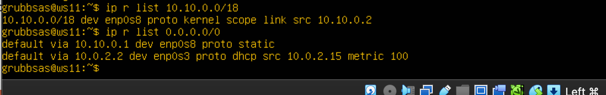
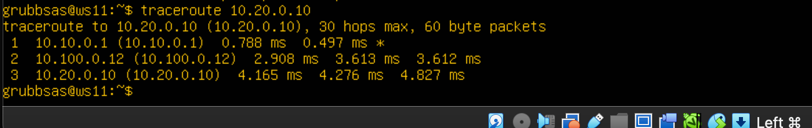
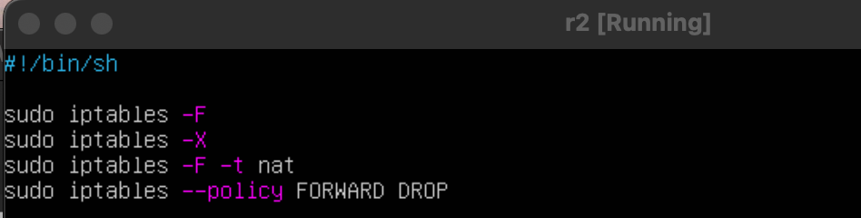
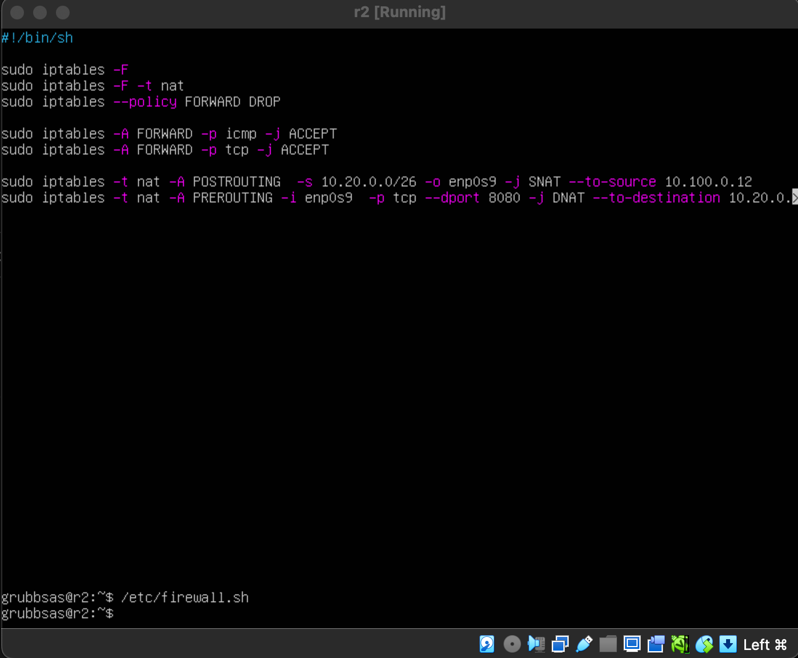
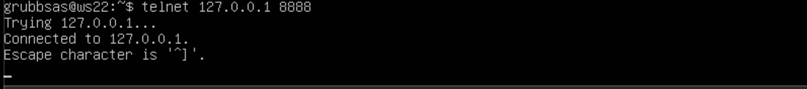

# Сети в Linux

## Part 1. Инструмент ipcalc

### 1.1
 
#### 1) 192.160.0.0
#### 2) 
    - /2; 11111111.11111111.11111111.00000000
    - 255.254.0.0; 11111111.11111111.0.00000000.00000000
    - 255.255.255.240; /28
#### 3) 
    - 12.0.0.1; 12.255.255.254
    - 12.167.0.1; 12.167.255.254
    - 2.167.38.1; 12.167.39.254
    - 12.0.0.1; 12.15.255.254

### 1.2
* Можно обратиться к приложению, работающему на **localhost**, только с `IP-адресами 127.0.0.1 и 127.1.0.1`, поскольку они относятся к диапазону адресов, зарезервированных для использования на локальном компьютере. 

### 1.3 

#### 1) IP-адреса, которые можно использовать только в качестве частных:
- 10.0.0.45
- 192.168.4.2
- 172.20.250.4
- 172.0.2.1
- 172.68.0.2
- 172.16.255.255
- 10.10.10.10

#### IP-адреса, которые можно использовать в качестве публичного IP:

- 134.43.0.2
- 192.172.0.1
- 192.169.168.1

#### 2) 
- 10.10.0.2
- 10.10.10.10

## Part 2. Статическая маршрутизация между двумя машинами

#### вызов команды `ip a` и его вывод

`-` 1 машина:
- Интерфейс lo:
- IPv4: 127.0.0.1/8
- IPv6: ::1/128

- Интерфейс enp0s3:
- MAC-адрес: 08:00:27:81:a3:d4
- IPv4: 10.0.2.15/24

`-` 2 машина:
- Интерфейс lo :
- IPv4: 127.0.0.1/8
- IPv6: ::1/128

- Интерфейс enp0s3:
- MAC-адрес: 08:00:27:88:5b:78
- IPv4: 10.0.2.15/24
- IPv6: fe80::a00:27ff:fe88:5b78/64

#### содержание изменённого файла `etc/netplan/00-installer-config.yaml` для 1 машины.

#### содержание изменённого файла `etc/netplan/00-installer-config.yaml` для 1 машины.

### Выполнил команду `netplan apply`

#### скрин с вызовом и выводом использованных команд для 1 машины.

#### скрин с вызовом и выводом использованных команд для 2 машины.

### 2.1. Добавление статического маршрута вручную

#### скрин с вызовом и выводом использованных команд для 1 машины.

#### скрин с вызовом и выводом использованных команд для 2 машины.

### 2.2. Добавление статического маршрута с сохранением

#### скрин с содержанием изменённого файла `etc/netplan/00-installer-config.yaml` для ws1

#### скрин с содержанием изменённого файла `etc/netplan/00-installer-config.yaml` для ws2

#### ws1

#### ws2

## Part 3. Утилита **iperf3**

### 3.1. Скорость соединения

    - 8 Mbps = 1 MB/s 
    - 100 MB/s = 819,200 Kbps 
    - 1 Gbps = 128 Mbps

### 3.2. Утилита iperf3

#### ws1 

#### ws2

## Part 4. Сетевой экран

### 4.1. Утилита **iptables**

#### ws1

#### ws2

### Запустил файлы на обеих машинах 

#### ws1

#### ws2

* Разница между стратегиями, применяемыми в файлах ws1 и ws2, заключается в порядке, в котором применяются правила разрешения и запрета. В ws1 сначала устанавливается правило запрета, а затем следуют правила разрешения. Это означает, что все входящие пакеты будут отброшены, за исключением тех, которые соответствуют правилам разрешения (SSH, HTTP, ICMP.png). В ws2 наоборот - сначала устанавливается правило разрешения, а только затем идут правила запрета. Это означает, что все входящие пакеты будут приняты, за исключением тех, которые соответствуют правилам запрета (SSH, HTTP, ICMP.png).

### 4.2. Утилита nmap

#### ws1

#### ws2

## Part 5. Статическая маршрутизация сети

### 5.1. Настройка адресов машин

#### ws1

#### ws21

#### ws22

#### r1

#### r2

* Перезапустил сервис сети. Если ошибок нет, то командой `ip -4 a` проверь, что адрес машины задан верно.

#### ws11

#### ws21

#### ws22

#### r1

#### r2

#### Также пропингуй ws22 с ws21.

#### Аналогично пропингуй r1 с ws11.

### 5.2. Включение переадресации IP-адресов

* Для включения переадресации IP, выполни команду на роутерах:
`sysctl -w net.ipv4.ip_forward=1`

#### r1

#### r2

* Открой файл /etc/sysctl.conf и добавь в него следующую строку:
`net.ipv4.ip_forward = 1`

#### r1

#### r2

### 5.3. Установка маршрута по-умолчанию

* Настрой маршрут по-умолчанию для рабочих станций. Для этого добавь `default` перед IP роутера в файле конфигураций.

#### ws11

#### ws21

#### ws22

#### Вызови `ip r` и покажи, что добавился маршрут в таблицу маршрутизации.

#### ws11

#### ws21

#### ws22

* Пропингуй с ws11 роутер r2 и покажи на r2, что пинг доходит. Для этого используй команду:
`tcpdump -tn -i eth0`

#### ws11

#### r2

### 5.4. Добавление статических маршрутов

* Добавь в роутеры r1 и r2 статические маршруты в файле конфигураций.

#### r1

#### r2

* Вызови `ip r` и покажи таблицы с маршрутами на обоих роутерах.

#### r1

#### r2

* Запусти команды на ws11:
`ip r list 10.10.0.0/`[маска сети] и `ip r list 0.0.0.0/0`

#### ws11 

 
* Для адреса 10.10.0.0/18 был выбран маршрут, отличный от 0.0.0.0/0, потому что при наличии нескольких маршрутов одинаковой длины выбирается тот маршрут, который задан наиболее точно.

### 5.5. Построение списка маршрутизаторов

#### r1

#### ws11

* Traceroute начинает с отправки пакетов с TTL, установленным на 1. Пакет с TTL=1 достигает первого маршрутизатора. Маршрутизатор уменьшает TTL до 0 маршрутизатор сбрасывает пакет и отправляет обратно сообщение ICMP "Time Exceeded" к отправителю. Отправитель записывает IP-адрес маршрутизатора. Затем traceroute увеличивает TTL на 1 и отправляет новый пакет. Этот процесс повторяется, пока пакет не достигнет конечного назначения или пока не будет достигнуто максимальное количество прыжков. Когда запрос попадёт на хост назначения, этот хост отправит ответ о недоступности порта «Destination port unreachable» (порт назначения недоступен.png). Это значит, что адресат получил запрос. Traceroute воспримет этот ответ как завершение трассировки. Дамп на R1 подтверждает правильную работу traceroute и показывает детали взаимодействия между узлами в сети.

### 5.6. Использование протокола ICMP при маршрутизации

#### Запусти на r1 перехват сетевого трафика

#### Пропингуй с ws11 несуществующий IP

## Part 6. Динамическая настройка IP с помощью DHCP

#### Для r2 настрой  конфигурацию службы DHCP:

####  В файле resolv.conf пропиши `nameserver 8.8.8.8.`
 

#### Перезагрузи службу DHCP 

#### Машину  перезагрузи  и через `ip` a покажи, что она получила адрес

#### Также пропингуй ws22 с ws21.

#### Укажи MAC адрес у ws11

* Для r1 настрой аналогично r2, но сделай выдачу адресов с жесткой привязкой к MAC-адрес

#### настрой конфигурацию службы DHCP:

#### измени файл `resolv.conf`

#### Перезагрузи службу DHCP

#### Машину ws21 перезагрузи при помощи `reboot` и через `ip` a покажи, что она получила адрес

#### Также пропингуй ws22 с ws11.

* Запроси с ws21 обновление ip адреса.

#### ip до

#### ip до

Команда `sudo dhclient -r enp0s3` освобождает текущий адрес интерфейса `enp0s3`. 
Команда `sudo dhclient enp0s3` задает новый адрес указанному интерфейсу.

## Part 7. NAT

### ws22 и r1 измени строку `Listen 80` на `Listen 0.0.0.0:80`

#### ws22

#### r1

### Запусти веб-сервер Apache командой `service apache2 start` на ws22 и r1.

#### ws22

#### r1

### Добавь в фаервол на r2 

#### Проверь соединение между ws22 и r1 командой ping.

#### Разрешить маршрутизацию всех пакетов протокола ICMP.

#### Проверь соединение между ws22 и r1 командой ping.

* Включи **SNAT**, а именно маскирование всех локальных ip из локальной сети, находящейся за r2
* Включи **DNAT** на 8080 порт машины r2 и добавить к веб-серверу Apache, запущенному на ws22

#### Проверь соединение по TCP для SNAT

#### Проверь соединение по TCP для DNAT

## Part 8. Дополнительно. Знакомство с **SSH Tunnels**

#### Запусти веб-сервер Apache на ws22 только на localhost

#### Воспользуйся **Local TCP forwarding** с ws21 до ws22

- `ssh -L 9999:localhost:80 10.20.0.20`

- `telnet`

#### Воспользуйся Remote TCP forwarding c ws11 до ws22

- `telnet`

